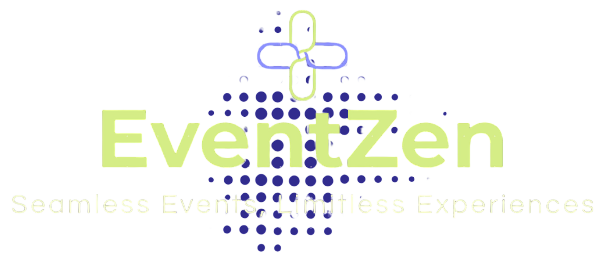

# EventZen - Event Management System



## Description
EventZen is a comprehensive event management platform with role-based access control, designed to provide seamless event management for both administrators and customers. Built with React and Vite, it offers a modern, responsive interface for managing events, bookings, and user profiles.

## Key Features

### User Features
- **Authentication**: Secure login and registration system
- **Profile Management**: Update personal information and preferences
- **Event Discovery**: Browse and search events with filtering options
- **Booking Management**: View and manage personal bookings
- **Customer Dashboard**: Overview of upcoming events and bookings

### Admin Features
- **Admin Dashboard**: Comprehensive overview of platform metrics
- **Event Management**: Create, update, and delete events
- **Attendee Management**: View and manage event attendees
- **Booking Management**: Oversee all bookings across events

## Project Structure

```
eventzen-frontend/
├── public/              # Static assets
├── src/
│   ├── assets/          # Images and logos
│   ├── Components/      # Reusable UI components
│   │   ├── AuthGuard/   # Authentication wrapper
│   │   ├── EventCard/   # Event display card
│   │   ├── FilterBox/   # Event filtering component
│   │   ├── Navigation/  # Main navigation
│   │   └── ...          # Other components
│   ├── hooks/           # Custom React hooks
│   ├── Modules/         # Feature modules
│   │   ├── admin/       # Admin-specific components
│   │   └── customer/    # Customer-specific components
│   ├── Page/            # Main page components
│   ├── services/        # API service modules
│   ├── App.jsx          # Main application component
│   └── main.jsx         # Application entry point
├── .env                 # Environment variables
├── package.json         # Project dependencies and scripts
└── vite.config.js       # Vite configuration
```

## Installation

1. Clone the repository:
```bash
git clone https://github.com/your-username/eventzen-frontend.git
cd eventzen-frontend
```

2. Install dependencies:
```bash
npm install
```

3. Create a `.env` file based on `.env.example` and configure your environment variables.

## Available Scripts

- `npm run dev`: Start development server (http://localhost:5173)
- `npm run build`: Create production build
- `npm run lint`: Run ESLint for code quality checks
- `npm run preview`: Preview production build locally

## Configuration

Required environment variables (set in `.env`):
```
VITE_API_BASE_URL=your_api_base_url
VITE_AUTH_TOKEN_KEY=auth_token_storage_key
```

## Technologies Used

### Core
- React 18
- Vite
- React Router
- Redux (State Management)

### UI Components
- Material UI
- Emotion (CSS-in-JS)

### API Communication
- Axios

### Code Quality
- ESLint

## Deployment

The application can be deployed to any static hosting service:
- Vercel
- Netlify
- AWS S3 + CloudFront
- Firebase Hosting

## Contributing

1. Fork the repository
2. Create your feature branch (`git checkout -b feature/your-feature`)
3. Commit your changes (`git commit -am 'Add some feature'`)
4. Push to the branch (`git push origin feature/your-feature`)
5. Open a Pull Request

## License

This project is licensed under the MIT License - see the [LICENSE](LICENSE) file for details.
